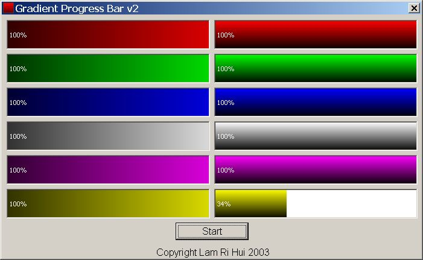



## Gradient Progress Bar v2

### Description

Gradient Progress Bar v2 is the second version in its series. This progress bar now comes with 12 types of gradient in two main categories: horizontal gradient and vertical gradient. They are 6 colors in each category. Comments are welcomed. If you liked this progress bar, please vote.
 
### More Info
 

             |
---                |---
**Submitted On**   |2003-11-12 01:35:12
**By**             |[Lam Ri Hui](https://github.com/Planet-Source-Code/PSCIndex/blob/master/ByAuthor/lam-ri-hui.md)
**Level**          |Intermediate
**User Rating**    |5.0 (35 globes from 7 users)
**Compatibility**  |VB 5\.0, VB 6\.0
**Category**       |[Custom Controls/ Forms/  Menus](https://github.com/Planet-Source-Code/PSCIndex/blob/master/ByCategory/custom-controls-forms-menus__1-4.md)
**World**          |[Visual Basic](https://github.com/Planet-Source-Code/PSCIndex/blob/master/ByWorld/visual-basic.md)
**Archive File**   |[Gradient\_P16710111122003\.zip](https://github.com/Planet-Source-Code/lam-ri-hui-gradient-progress-bar-v2__1-49845/archive/master.zip)

